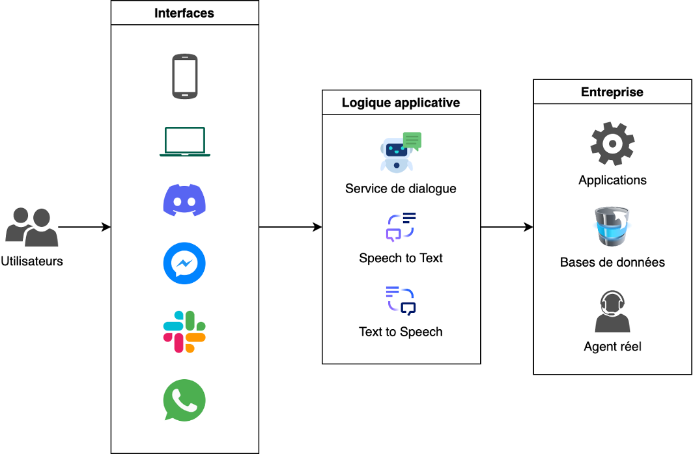

# Ameliorer votre chatbot avec des APIs

L'objectif de ce TP est de montrer un exemple d'intégration de Chatbot à une API externe, c'est typiquement ce genre de méthode de communication qui est utilisé par un chatbot d'entreprise pour récuperer des données de services de l'entreprise, base de données, etc.



De manière générale, les programmes peuvent s'échanger des données d'un ordinateur à l'autre, d'une application à l'autre à l'aide d'API, c'est une méthode très utilisée.  

Essayez par exemple l'API **_timeapi_**, depuis un client web, entrez l'adresse : [https://timeapi.io/api/Time/current/zone?timeZone=Europe/Paris](https://timeapi.io/api/Time/current/zone?timeZone=Europe/Paris)

On obtient une réponse comme ceci : 

```json
{
  "year": 2023,
  "month": 1,
  "day": 18,
  "hour": 11,
  "minute": 17,
  "seconds": 15,
  "milliSeconds": 624,
  "dateTime": "2023-01-18T11:17:15.6241972",
  "date": "01/18/2023",
  "time": "11:17",
  "timeZone": "Europe/Paris",
  "dayOfWeek": "Wednesday",
  "dstActive": false
}
```

Il s'agit d'un format appelé **JSON** (JavaScript Object Notation), il n'est pas agréable à lire, c'est normal, c'est fait pour être lu par un programme, pas par un humain. 

On reconnait tout de même les données.

Elles sont séparées par des virgules et sont écrites: `"nom_de_la_donnee":"valeur"`

Vous pouvez essayer d'autres villes en `Europe`, mais aussi dans les zones : `America`, `Asia`, `Africa`, `Atlantic`, `Australia`. Vous trouverez la liste des timezones disponibles ici: [http://worldtimeapi.org/api/timezone](http://worldtimeapi.org/api/timezone)

Depuis une ligne de commande de votre ordinateur, vous pouvez obtenir le même résultat avec la commande `curl`, qui peut être téléchargée via [https://curl.se/download.html](https://curl.se/download.html)

```sh
curl "http://worldtimeapi.org/api/timezone/Europe/Paris"
```

Les languages de programmation permettent bien sur d'utiliser des API, par exemple, pour récupérer l'heure et l'afficher, en python:

```python
import requests
# Function to get current time of selected timezone 
def get_time(timezone):
    url = f"https://timeapi.io/api/Time/current/zone?timeZone={timezone}"
    response = requests.request('GET', url, headers={}, data={})
    return response.json()
print(get_time('Europe/Paris'))
```

Il y a aussi l'API des images de chats, selon les codes HTTP: [https://http.cat/404](https://http.cat/404)

## Exercice 1: Donner l'heure avec le chatbot

Vous allez maintenant ajouter une fonctionnalité à votre chatbot, celle de lui demander l'heure qu'il est dans un endroit dans le monde, grâce à l'API que nous avons vu juste avant.

Cette fonctionnalité se décomponse en 2 étapes:

- La première étape est de modifier le code RiveScript de sote à ce qu'il reconnaisse notre demande lorsque nous lui demandons l'heure. Rivescript n'étant que l'outil de dialogue, il n'est pas capable de récuperer l'heure, nous auront donc besoin de Python pour la seconde étape.
- La seconde est de modifier le script Python pour qu'il appelle l'API `timeapi` afin de récupere l'heure de la bonne timezone, puis la renvoi sous forme de réponse.

1. Modifier votre fichier `.rive` afin qu'il capture une demande d'heure:
    ```rivescript
    ! sub nyc = new york
    + * heure * (paris|montpellier|marseille|londres|new york|tokyo)
    - !!time$$<star3>
    ```
    - **Note**: ici nous n'envoyons pas une réponse typique mais une réponse formattée de manière très précise, débutant par `!!` (c'est un exemple, un autre format peut être utilisé) afin de permettre à notre script Python de reconnaitre qu'une action spéciale sera nescessaire avant d'envoyer la réponse, ici récuperer l'heure à un endroit donné (une ville que nous enregistrons dans la réponse à la suite de `$$` en utilisant la syntaxe Rivescript `<star3>`).
2. Modifier votre fichier `script.py` afin qu'il capture l'action spécifiée par Rivescript, la ville et effecture la demande d'heure:
    ```python
    from rivescript import RiveScript
    import requests
    import discord
    import os

    # Function to get current time of selected timezone 
    def get_time(timezone):
        url = f"https://timeapi.io/api/Time/current/zone?timeZone={timezone}"
        response = requests.request('GET', url, headers={}, data={})
        return response.json()

    # Inits Rivescript bot
    bot = RiveScript()
    bot.load_directory('./eg/brain')
    bot.sort_replies()

    # Inits Discord client
    intents = discord.Intents.default()
    intents.message_content = True
    client = discord.Client(intents=intents)

    # Handles Discord login event
    @client.event
    async def on_ready():
        print(f'We have logged in as {client.user}')

    # Handles Discord message event
    @client.event
    async def on_message(message):
        if message.author == client.user:
            return

        reply = bot.reply('localuser', message.content)
        if reply.startswith('!!'):
            action = reply.replace('!!', '').split('$$')[0]
            if action == 'time':
                location = reply.replace('!!', '').split('$$')[1]
                timezone = 'Europe/Paris'
                if location == 'londres':
                    timezone = 'Europe/London'
                elif location == 'new york':
                    timezone = 'America/New_York'
                elif location == 'tokyo':
                    timezone = 'Asia/Tokyo'
                time = get_time(timezone)
                reply = f'A {location}, il est {time["time"]}'
        await message.channel.send(reply)

    # Run discord client using bot token
    client.run(os.environ['DISCORD_TOKEN'])
    ```
    - **IMPORTANT**: Prenez le temps de bien comprendre ce que fais ce script (vous en aurez besoin pour effectuer les prochains exercices): Une fois la réponse de Rivescript reçue, nous vérifions si une action est nescessaire en regardant si la réponse débute par `!!`. Si c'est le cas, nous récupérons l'action qui se situe dans la réponse juste après `!!` et avant un éventuel `$$` qui correspond à l'information sur la ville. Ensuite, nous récupérons la ville souhaitée en récuperant la partie qui se situe après le premier `$$` dans la réponse, puis nous en déduisons la bonne timezone et enfin nous faisons la requête à l'API en appelant la fonction `get_time(timezone)`. Enfin, nous formattons la réponse à envoyer dans le channel Discord.
3. Lancer le script: `python script.py`

## Exercice 2: Donner la météo courante avec le chatbot

Maintenant, on vous demande de répliquer ce que vous avez fait mais en donnant cette fois la météo à une localisation donnée.

Pour cela, nous allons utiliser une nouvelle API [OpenWeather](https://openweathermap.org/), qui propose un certain nombre de requêtes liées à la météo, dont certaines d'entre elles sont accessible gratuitement, avec un nombre limité d'appel.

Comme la plupart des API d'aujourd'hui, vous aurez donc besoin de vous authentifier pour pouvoir y accéder. Pour cela nous vous fournissons une clé d'API que vous devrez placer dans une variable d'environnement, la commande suivante devrait être familière:

```sh
export WEATHER_API_KEY='eb3b2b419515211fc59b8cc86bcbaa4c'
```

Nous vous donnons également la fonction Python qui vous sera utile pour récuperer, via cette API, la [météo courante](https://openweathermap.org/current):

```python
# Function to get weather
def get_weather(lat, lon):
    url = f"https://api.openweathermap.org/data/2.5/weather?lat={lat}&lon={lon}&appid={os.environ['WEATHER_API_KEY']}&lang=fr&units=Metric"
    response = requests.request('GET', url, headers={}, data={})
    return response.json()
```

Comme vous pouvez le voir, cette fonction envoie une requête d'API à OpenWeather et utilise la clé d'API que vous avez enregistrez dans la variable d'environnent `WEATHER_API_KEY` pour authentifier vos requêtes.

Cette fonction a 2 paramètres:
 - `lat`: La lattitude de l'endroit pour lequel vous souhaitez récupérér la météo.
 - `lon`: La longitude de l'endroit pour lequel vous souhaitez récupérér la météo.

Pour récuperer ces informations, vous pouvez par exemple vous rendre sur Google Maps, naviguer à l'endroit souhaité et vous trouverez les coordonnées dans l'URL du navigateur, par exemple la place de la comédie à Montpellier: [https://www.google.fr/maps/@43.6084137,3.8793402,18.87z](https://www.google.fr/maps/@43.6084137,3.8793402,18.87z)

La lattitude de la place de la comédie est donc environ `43.608`, sa longitude environ `3.879`.

En appliquant vos connaissances de l'exercice précédant, ecrivez le code Rivescript et Python nescessaire pour permettre à votre chatbot de répondre à ce type de requêtes:
 - quelle est la meteo a Montpellier?
 - quel est le temps a Montpelier?

La réponse attendue est quelque chose du type: `Actuellement, le temps est: nuageux, la temperature ressentie est de -0.22 °c`.

## Exercice 3: Donner la météo des 5 prochains jours avec le chatbot

La même API [OpenWeather](https://openweathermap.org/) permet de récuperer les [prévisions météos des 5 prochains jours](https://openweathermap.org/forecast5).

Voici la fonction Python qui vous permettra de faire cette requête: 

```python
# Function to get 5 days weather forecast
def get_weather_forecast(lat, lon):
    url = f"https://api.openweathermap.org/data/2.5/forecast?lat={lat}&lon={lon}&appid={os.environ['WEATHER_API_KEY']}&lang=fr&units=Metric"
    response = requests.request('GET', url, headers={}, data={})
    return response.json()
```

En appliquant vos connaissances de l'exercice précédant, ecrivez le code Rivescript et Python nescessaire pour permettre à votre chatbot de répondre à ce type de requêtes:
 - quelle sera la meteo dans les prochains jours?
 - quel sera le temps demain?

La réponse attendue est quelque chose du type:

```
Voici la prevision meteo pour les 5 prochains jours à Montpellier:
  - 2023-01-18: nuageux, temperature 3.62 °c
  - 2023-01-19: peu nuageux, temperature 3.8 °c
  - 2023-01-20: nuageux, temperature 2.63 °c
  - 2023-01-21: ciel dégagé, temperature 1.38 °c
  - 2023-01-22: partiellement nuageux, temperature 2.4 °c
```

## Exercice 4 (si vous avez le temps): Donner la qualité de l'air avec le chatbot

La même API [OpenWeather](https://openweathermap.org/) permet de récuperer des informations sur la [pollution de l'air](https://openweathermap.org/api/air-pollution).

Voici la fonction Python qui vous permettra de faire cette requête: 

```python
# Function to get 5 days weather forecast
def get_weather_forecast(lat, lon):
    url = f"https://api.openweathermap.org/data/2.5/air_pollution?lat={lat}&lon={lon}&appid={os.environ['WEATHER_API_KEY']}&lang=fr&units=Metric"
    response = requests.request('GET', url, headers={}, data={})
    return response.json()
```

Cette API Pollution de l'air fournit des données actuelles sur les gaz polluants, tels que le monoxyde de carbone (CO), le monoxyde d'azote (NO), le dioxyde d'azote (NO2), l'ozone (O3), le dioxyde de soufre (SO2), l'ammoniac (NH3) et les particules (PM2,5 et PM10). La réponse au format JSON a le format suivant:

```json
{
    "coord": {
        "lon": 3.83,
        "lat": 43.61
    },
    "list": [
        {
            "main": {
                "aqi": 1
            },
            "components": {
                "co": 223.64,
                "no": 0.19,
                "no2": 1.78,
                "o3": 55.08,
                "so2": 0.31,
                "pm2_5": 0.5,
                "pm10": 0.62,
                "nh3": 0.23
            },
            "dt": 1674034957
        }
    ]
}
```

Vous trouverez un tableau indiquant les niveaux de qualité de l'air en fonction de la concentration de ces gaz polluant dans l'air ici: [https://openweathermap.org/api/air-pollution](https://openweathermap.org/api/air-pollution)

En appliquant vos connaissances de l'exercice précédant, ecrivez le code Rivescript et Python nescessaire pour permettre à votre chatbot de répondre à ce type de requêtes:
 - quelle est la qualite de l air a Montpellier?

La réponse attendue est quelque chose du type: `La qualité de l'air à Montpellier est actuellement moyenne.`
