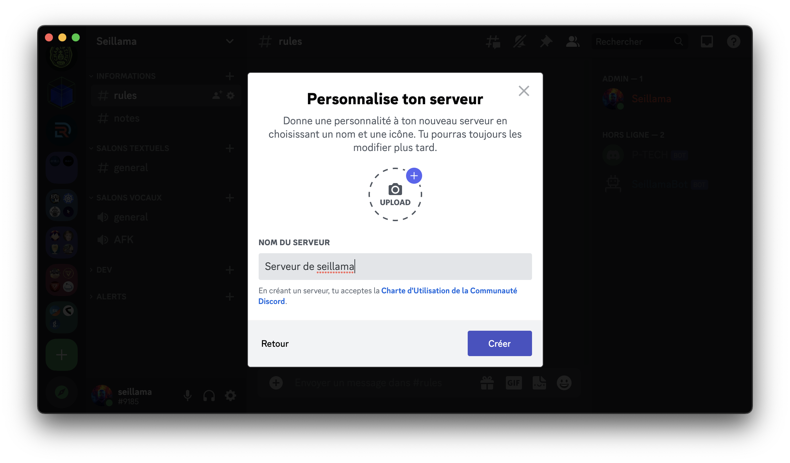
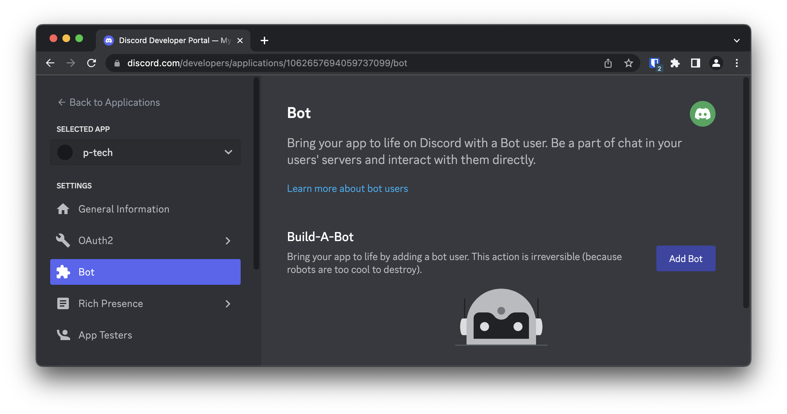

# Integration de votre Chatbot avec Discord

Discord est un logiciel propriétaire gratuit de VoIP et de messagerie instantanée. Il fonctionne sur les systèmes d’exploitation Windows, macOS, Linux, Android, iOS ainsi que sur les navigateurs web.

Conçu initialement pour les communautés de joueurs de jeux vidéo, son utilisation s'est diversifiée avec le temps et compte aujourd'hui plus de 300 millions d'utilisateurs.

L'opbectif de ce TP est de montrer un example d'intégration de Chatbot à une interface de communication, ici Discord. De nombreuses autres intégrations sont possible, et fonctionnent de manière similaires pour tout logiciel de messagerie instantanée:


## Accès Discord

Si vous n'avez pas Discord installé sur votre ordinateur, installez le via ce lien: [https://discord.com/download](https://discord.com/download)

Une fois Discord installé, connectez-vous à votre compte ou créez en un nouveau:


## Serveur Discord

Pour permettre à votre chatbot the communiquer via un canal Discord vous aurez besoin d'un accès administrateur à un serveur Discord.

Créez un nouveau serveur Discord en cliquant sur **Ajouter un serveur** en bas à gauche de l'application:


Selectionnerionner **Créer le mien**:


Selectionnerionner **Pour mes amis et moi**:


Saisir un nom de serveur:



Et voilà! Votre serveur devrait être disponible!


## Application et Bot Discord

Une fois votre serveur créer et accessible, créez une nouvelle application discord en accédant à [Discord Developers](https://discord.com/developers/applications):


Donner un nom à votre application et cliquez sur **Créer**:


Une fois votre application créée allez dans la section **Bot** et cliquer sur **Ajouter un bot**:



Une fois votre bot créé, activez **Message Content Intent** dans la partie **Privileged Gateway Intents** afin de permettre à votre bot de recevoir le contenu des messages discord:


Toujours dans l'onglet Bot, cliquez sur **Réinitialiser le token**:


Copiez le token généré et dans votre terminal Gitpod, et saisissez la commande suivante pour enregistrer le token dans une variable d'environnement `DISCORD_TOKEN` (celle-ci sera utilisée par la suite par votre script python pour connecter votre bot Discord):

```
❯ export DISCORD_TOKEN='MTA2Mj...2tEfQSw'
```

## Inviter votre bot à votre serveur

De retour sur **Discord Developers**, allez à l'onglet **URL Generator** de la section **OAuth2**:


Ajouter les permissions nescessaire à votre bot:
  1. Selectionner le scope `bot`.
  2. Selectionner `Read Messages/View Channels` dans **GENERAL PERMISSIONS**.
  3. Selectionner `Send Messages`, `Embed Links`, `Attach Files` dans **TEXT PERMISSIONS**.
  4. Cliquer sur **Copier** pour copier l'URL générée:


Ouvrez l'URL dans votre navigateur et inviter votre bot à votre nouveau serveur discord:


Authorizer les permissions demandées pour votre bot:


Votre bot devrait maintenant apparaitre dans les utilisateurs de votre serveur!


## Connecter votre bot

Après avoir ouvert votre code existant sur [Gitpod](https://gitpod.io), saisir la commande suivante dans le terminal pour installer la librairie Python `discord`:

```sh
❯ pip install discord.py
```

Ensuite, créez un script `script-discord.py` pour ajouter l'integration discord:

```python
import discord
import os

# Init Discord client
intents = discord.Intents.default()
intents.message_content = True
client = discord.Client(intents=intents)

# Handles Discord login event
@client.event
async def on_ready():
    print(f'We have logged in as {client.user}')

# Run discord client using bot token
client.run(os.environ['DISCORD_TOKEN'])
```

Lancer le script python:

```sh
❯ script-discord.py
```
Vous deviez maintenant voir votre bot connecté à votre serveur:


## Capturer les messages envoyés sur Discord

Modifiez votre script Python `script-discord.py` pour catpurer les messages reçu sur le channel Discord, les afficher dans la console et les renvoyer dans le channel:

```python
import discord
import os

# Init Discord client
intents = discord.Intents.default()
intents.message_content = True
client = discord.Client(intents=intents)

# Handles Discord login event
@client.event
async def on_ready():
    print(f'We have logged in as {client.user}')

# Handles Discord message event
@client.event
async def on_message(message):
    if message.author == client.user:
        return
    print(f'MESSAGE: {message.content}')
    await message.channel.send(f'REPONSE: {message.content}')

# Run discord client using bot token
client.run(os.environ['DISCORD_TOKEN'])
```

Lancer le script:

```sh
❯ script-discord.py
```

Essayez maintenant d'envoyer un message dans le channel **général** de votre serveur Discord, vous devriez vois ce message affiché dans la console de votre terminal ainsi que dans la réponse de votre bot:


## Utilisez votre chatbot RiveScript

Modifiez votre script Python `script-discord.py` pour ajouter l'interpreteur RiveScript:

```python
from rivescript import RiveScript
import discord
import os

# Init Rivescript bot
bot = RiveScript()
bot.load_directory("./eg/brain")
bot.sort_replies()

# Init Discord client
intents = discord.Intents.default()
intents.message_content = True
client = discord.Client(intents=intents)

# Handles Discord login event
@client.event
async def on_ready():
    print(f'We have logged in as {client.user}')

# Handles Discord message event
@client.event
async def on_message(message):
    if message.author == client.user:
        return
    reply = bot.reply("localuser", message.content)
    await message.channel.send(reply)

# Run discord client using bot token
client.run(os.environ['DISCORD_TOKEN'])
```

Lancer le script:

```sh
❯ script-discord.py
```

Et voilà! Vous deviez maintenant pouvoir envoyer des messages à votre bot:


